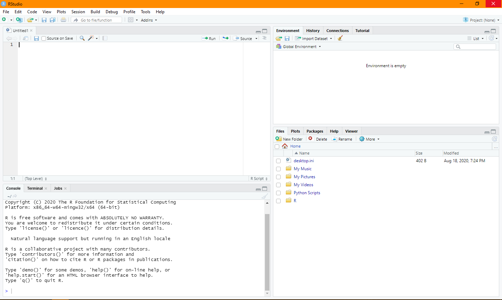
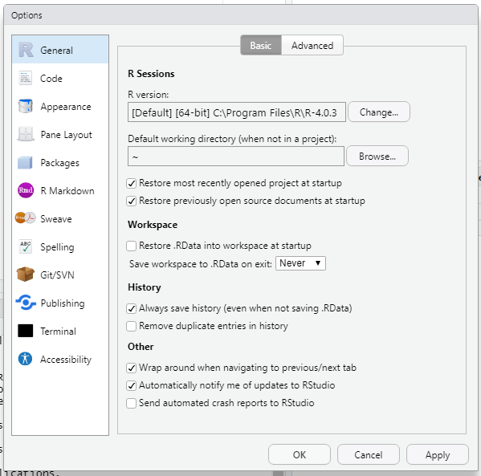
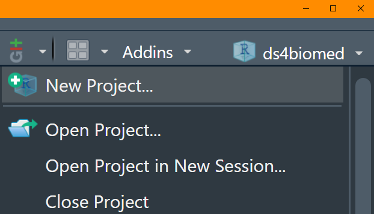

## Knowing your way around RStudio

Let's start by learning about [RStudio](https://www.rstudio.com/), which is an
Integrated Development Environment (IDE) for working with R.
**R** is the **programming language** that is used to execute commands and give us results.
**RStudio** is a piece of software that makes writing R code easier.
This specialized piece of software is commonly called an **Integrated Development Environment (IDE)**.
The reason why we use an IDE over just using the bare programming language,
is that the IDE gives easily gives us more information and exploration tools without having to constantly
run the commands to display them.

We will use RStudio IDE to write code, navigate the files on our computer,
inspect the variables we are going to create, and visualize the plots we will
generate. RStudio can also be used for other things (e.g., version control,
developing packages, writing Shiny apps) that we will not cover during the
workshop.

One of the advantages of using RStudio is that all the information you need to
write code is available in a single window. Additionally, with many shortcuts,
autocompletion, and highlighting for the major file types you use while
developing in R, RStudio will make typing easier and less error-prone.

## The panels

When you launch RStudio you may have 3 panels as shown.

The **Console** on the left side is where you can input R code to be executed and results are output.
However, running code in this fashion does not give us the ability to **save**
the code we write to later use.

If we go to `File > New File > R Script`, a 4th empty panel will appear;
By default the tab's name will be `Untitled1`.
This is the **source** panel, where we write our **source code** that can be saved.

The top right panel has a few tabs:

- Environment: When you start programming the data sets you load up and the variables you create will be displayed here.
- History: The commands you run in the console, by either typing them directly or sent from the source panel,
  will be logged here.
- Connections, Build, Git: Other tabs that will be more useful as we use R more often.
  Do not worry if those tabs do not show up in your RStudio instance.
- Tutorial: A new feature that allows other R developers to create tutorials that can be run within RStudio

The bottom right panel also has a few tabs.

## Executing R code

There are a few ways we can run R code.
In the toolbar on the top, under `Code`, towards the bottom,
you will see a section that talk about `Run`ing code.
There will be a line that says `Run Selected Line(s)  Ctrl+Enter`
which tells us we can select lines in the source panel and use the `Ctrl+Enter` keyboard short cut
to send the selected lines into the console,
where it will be executed.

In the top right corner of the source panel quadrant,
there are also buttons for `Run` which will do the same thing as the `Ctrl+Enter` keyboard shortcut
along with the `Source` button, which will run the current source file from top to bottom.

## Global settings

You can find various settings under `Tools > Global Options...`.
On the first `General > Basic` tab, you want to make sure the "Restore .RData into workspace at start up" is **unchecked**, and "Save workspace to .RData on exit" is set to **Never**.

This will make sure when you open RStudio again, you are always going to start off with an **empty** environment,
and data sets won't be restored for you on launch.
It may seem like a good idea for your last state to be automatically loaded,
but it will eventually lead to confusion since the chances are high that you will not remember everything you did during your previous session.

This will force you to re-run your code so the code you are working with properly replicates the environment you expect.
Also, when working with large datasets, these options will cause RStudio to take a longer time to start,
since it will try to load these large datasets.
Making sure start up settings are disabled will make sure your R environment will quickly load an empty environment every time you start RStudio.

Other options to consider is to also **uncheck** the first 2 options, "Restore most recently opened project at start up" and "Restore previously open source documents at start up",
as those options will make sure RStudio starts off completely empty without loading *anything*,
including previously opened projects and documents.

## RStudio projects {#rstudio-projects}

The top right corner of the RStudio panel will show the current RStudio project that is open.
By default it will say `Project (None)`.

This book has an RStudio project that has a basic folder structure and data sets.
As a general rule, every analysis project you work on should be made into an RStudio project.
A new project can be created by clicking the Project tab on the top right corner and selecting `New Project`.

The main benefit of using projects for your own work is that the project is more portable across multiple computers,
and across collaborators.

> ## Exercise 1
>
> 1. Open the RStudio project for this workshop/book located in a file named `ds4biomed.Rproj`.
> You can find it on your Desktop in the `ds4biomed-learner` folder. Refer to the
> [Setup instructions]({{ page.root }}) if you do not have this
> folder on your Desktop yet.  
> 2. Click on the Files tab in the lower right panel.
> 3. Move into the `analysis` folder with Session &#8594; Set Working Directory &#8594; Choose Directory.
> Select the `analysis` folder.
> 4. Create a new R script and save it to the `analysis` folder as the file `00-newscript.R`.    
> 5. On line 1 type: `3 + 3`   
> 6. On line 3 type: `print("ds4biomed")`  
> 7. Run these lines of code one line at a time (e.g., using `Ctrl+Enter`)  
> 8. Run all the lines at once (e.g., clicking the `Source` button)  
>
> >
> > ## Solution
> >
> >
> >
> {: .solution}
{: .challenge}
